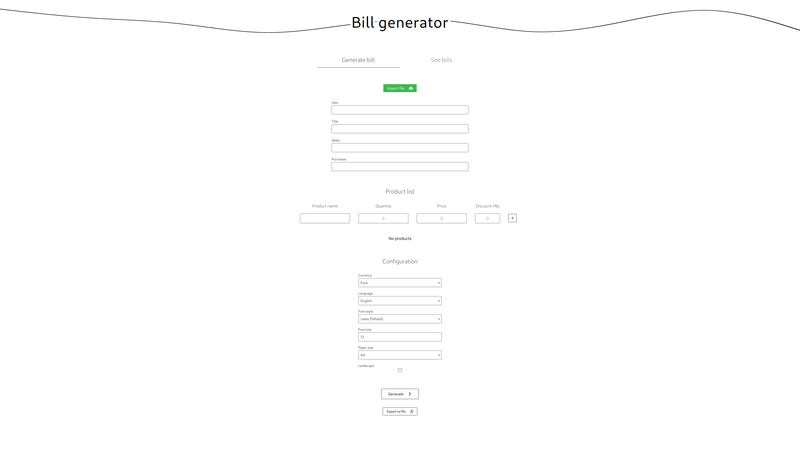

# Bills Generator

## Introdución e requisitos

Bills Generator é un sistema de xeración de facturas automático en formato PDF, cuxo obxectivo principal é o de **facilitar o proceso de xeración de facturas**, así como o de
uniformizar o seu formato e o de ofrecer un lugar onde almacenalas de xeito centralizado. O sistema está principalmente pensado para ser **empregado
por empresas de pequeno e medio tamaño**, ou calquer outro tipo de entidade sen a capacidade de manter un sistema de semellantes características.

### Requisitos funcionais

Á hora de desenvolver o sistema, tivemos en conta os seguintes requisitos funcionais:

- O sistema debe permitir **xerar un ficheiro PDF coa información da factura para un usuario específico**. Dita información debe incluír:
  - Nome do usuario
  - Título
  - Vendedor
  - Comprador
  - Porcentaxe de impostos
  - Lista de productos (cada un co seu nome, prezo, cantidade e desconto)
- O sistema debe permitir **consultar as facturas realizadas por un determinado usuario**. Entre a información mostrada para cada factura, é importante incluír tanto o título que se lle deu
  coma a data de xeración da mesma.
- O sitema debe permitir **descargar as facturas xeradas**, incluíndo as xeradas con anterioridade.
- O sistema debe poder **importar información de facturas** en formato JSON, coa validación que iso conleva. Ademáis, debe tamén posibilitar o **exportado da información da factura
  que se quere xerar**.
- O sistema debe permitir **personalizar o estilo de factura**. Débese poder cambiar:
  - A divisa utilizada
  - A linguaxe
  - A familia da fonte
  - O tamaño da fonte
  - O tipo de papel
  - O formato apaisado

### Requisitos non funcionais

Como requisitos non funcionais, establecimos os seguintes:

- O sistema debe ser **accesible dende calquera dispositivo**, incluíndo dispositivos móbiles.
- O sistema debe ser **intuitivo e fácil de usar por calquera persona**, xa que os usuarios finais non teñen por que ser expertos en informática.
- O sistema debe ser **rápido**, tanto na xeración de facturas como na consulta das mesmas, debido a unha posible carga elevada do sistema. Buscaríamos poder xerar unha factura en menos de medio segundo e de
  atender preto de 500 peticións de xeración por minuto.
- O sistema debe ser **escalable**, é dicir, debe permitir ampliar a capacidade de cómputo (agregando máis servidores) e a capacidade de almacenamento (agregando máis discos) sen que o sistema
  deixe de funcionar correctamente.
- O sistema debe de **manter unha dispoñibilidade alta, preto do 100%**, xa que os clientes non poden permitirse que o sistema esté caído durante moito tempo.
- O sistema debe **garantir a integridade das facturas**, é dicir, se o sistema cae, non se debe perder a infomación das facturas que se estaban xerando.
- O sitema debe **permitir unha monitorización do mesmo**, puidendo consultar o seu estado interno en todo momento.

## Arquitectura e tácticas

### Arquitectura do Backend

Con todo, optamos por utilizar unha arquitectura que aglutina a súa vez varias arquitecturas diferentes:

- Unha arquitectura en **pipeline**: O proceso de xeración é un proceso en serie, no que se van executando varias tarefas en orde, cada unha dependendo da anterior (Ver diagrama C4 de contedor).
  Por este motivo, optamos por utilizar unha arquitectura en pipeline nesta parte do sistema.

- Unha arquitectura **líder-traballador**: Debido ó requisito non funcional de rendemento, non podíamos permitirnos o feito de que, habendo etapas do _pipeline_ que conlevan unha carga máis elevada ca o resto,
  ditas etapas causesen un _bottleneck_ no sistema. Para evitar isto, optamos por utilizar unha arquitectura líder-traballador, na que cada etapa do _pipeline_ contaría co seu propio líder
  e o seus propios traballadores. De este forma, o sistema sería capaz de crear novos traballadores e eliminar os que xa non son necesarios, de xeito que se poida adaptar automáticamente a carga
  que conleva cada etapa.

- Unha arquitectura **cliente-servidor**: Para poder atender as peticións HTTP que chegan ao sistema, o contar cun directorio capaz de redirixilas ao servizo é necesario. Neste caso,
  só contamos cun único servizo pero, pensando na ampliación de funcionalidades, poderíanse implementar novos servizos sen poñer en risco ningunha das características actuais do sistema.

Ademáis, cabe destacar a utilización dunha base de datos á que accede o servizo de facturas. A pesar de non formar parte dunha arquitectura en repositorio, a base de datos é unha parte
esencial do sistema, xa que nos permite cumplir varios dos requisitos funcionais que se estableceron ao inicio, como é o da persitencia dos datos para un acceso posterior.

### Arquitectura do Frontend

Para cumplir o tanto o requisito de accesibilidade dende calquer dispositivo coma o de ser intuitivo e fácil de utilizar, era prácticamente obligatorio que o sistema contase cunha interface web.
O arquitectura utilizada para o frontend é o de un cliente-servidor básico, no que o cliente só solicita información estática (css, html, javascript...) ao servidor.

### Tácticas aplicadas

Dado que aínda quedan requisiton non funcionais sen cumprir, utilizáronse as seguintes táctias para poder atender a todos eles:

- No contexto de detección de erros, fíxose **uso de excepcións** para poder detectar e tratar os erros que poidan ocorrer durante a execución do sistema. Estas excepcións son
  manexadas polos propios compoñentes do sistema.

- No contexto de recuperación de erros, era moi importante o feito de que as facturas non se perdesen en caso de caída do sistema. Para iso, ademáis
  de implementar un sistema de **redundancia pasiva** o cal relanza un compoñente se este cae.

- Para tratar a prevención de erros implementouse un **monitor de procesos**, encargado de informar do estado interno do sistema, isto é, do número de traballadores que ten cada etapa do
  _pipeline_ en cada momento. Ademáis, utilizouse un sistema de _loggin_ para poder ter unha visión máis ampla de que é o que está facendo o sistema.

- Xa no terreo das tácticas de seguridade, a especificación dos requisitos non funcionais establecía que unha parte moi importante era o da integridade das facturas.
  Para cubrir este aspecto, utilizouse un compoñente que fai de **cache** para almacenar a información das facturas en xeración, de xeito que se o sistema cae, poda accederse
  á información almacenada nel.

No noso caso, ao utilizar unha arquitectura líder-traballador, xa contamos cunha táctica de rendemento como é o da **replicación de procesos** no contexto da xestión
de recursos. Tamén gustaríanos ter implementada algunha táctica máis de seguridade como é a da autenticación pero dado que non se especificaba como un requisito (e pola súa dificultade)
decidimos non implementala.

# Execución do sistema

## Lanzamento

Para facilitar o proceso de posta en marcha do sistema, fíxose uso da ferramenta _Docker_.

Para poder executar tanto o _backend_ coma o _frontend_ do sistema, basta con executar o seguinte comando:

> Asumindo que se está na raíz do repositorio

```console
docker compose up -d
```

O comando anterior executará os contenedores do _backend_ e do _frontend_ en segundo plano e abrirá o porto 3000 na máquina _host_. Para poder acceder ao sistema, basta con acceder á seguinte URL: `http://localhost:3000`.

## Tests

Para poder executar os tests, é necesario executar o seguinte comando:

```console

```

# Capturas




