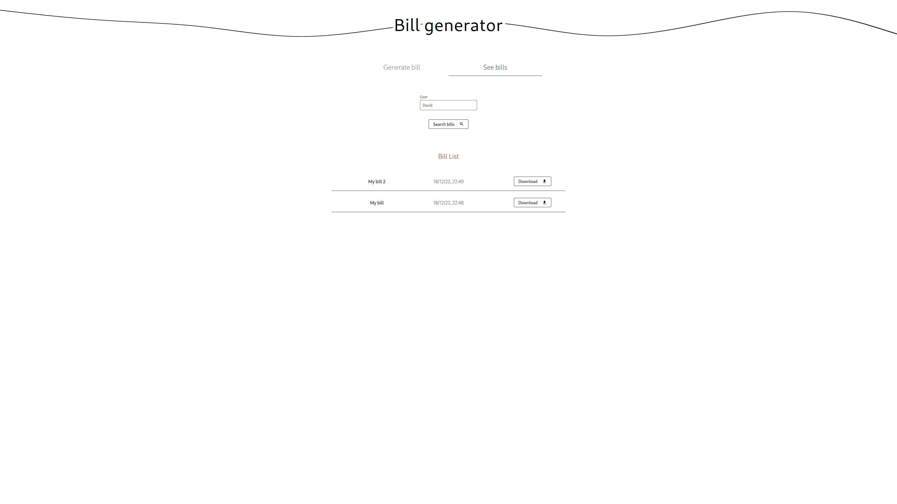

# Bills Generator

## Introdución e requisitos

Bills Generator é un sistema de xeración de facturas automático en formato PDF, cuxo obxectivo principal é o de **facilitar o proceso de xeración de facturas**, así como o de
uniformizar o seu formato e o de ofrecer un lugar onde almacenalas de xeito centralizado. O sistema está principalmente pensado para ser **empregado
por empresas de pequeno e medio tamaño**, ou calquer outro tipo de entidade sen a capacidade de manter un sistema de semellantes características.

### Requisitos funcionais

Á hora de desenvolver o sistema, tivemos en conta os seguintes requisitos funcionais:

- O sistema debe permitir **xerar un ficheiro PDF coa información da factura para un usuario específico**. Dita información debe incluír:
  - Nome do usuario
  - Título
  - Vendedor
  - Comprador
  - Porcentaxe de impostos
  - Lista de productos (cada un co seu nome, prezo, cantidade e desconto)
- O sistema debe permitir **consultar as facturas realizadas por un determinado usuario**. Entre a información mostrada para cada factura, é importante incluír tanto o título que se lle deu
  coma a data de xeración da mesma.
- O sitema debe permitir **descargar as facturas xeradas**, incluíndo as xeradas con anterioridade.
- O sistema debe poder **importar información de facturas** en formato JSON, coa validación que iso conleva. Ademáis, debe tamén posibilitar o **exportado da información da factura
  que se quere xerar**.
- O sistema debe permitir **personalizar o estilo de factura**. Débese poder cambiar:
  - A divisa utilizada
  - A linguaxe
  - A familia da fonte
  - O tamaño da fonte
  - O tipo de papel
  - O formato apaisado

### Requisitos non funcionais

Como requisitos non funcionais, establecimos os seguintes:

- O sistema debe ser **accesible dende calquera dispositivo**, incluíndo dispositivos móbiles.
- O sistema debe ser **intuitivo e fácil de usar por calquera persona**, xa que os usuarios finais non teñen por que ser expertos en informática.
- O sistema debe ser **rápido**, tanto na xeración de facturas como na consulta das mesmas, debido a unha posible carga elevada do sistema. Buscaríamos poder xerar unha factura en menos de medio segundo (_latencia_) e de
  atender preto de 500 peticións de xeración por minuto (_throughput_).
- O sistema debe ser **escalable**, é dicir, debe permitir ampliar a capacidade de cómputo (utilizando máis recursos dun ordenador ou rede de ordenadores) sen que o sistema
  deixe de funcionar correctamente.
- O sistema debe de **manter unha dispoñibilidade alta, preto do 100%**, xa que os clientes non poden permitirse que o sistema esté caído durante moito tempo.
- O sistema debe **garantir que as facturas que chegan ao sistema non se perdan**, na medida do posible, xa que é necesario para unha boa experiencia do usuario.
- O sitema debe **permitir unha monitorización do mesmo**, puidendo consultar o seu estado interno en todo momento.

## Arquitectura e tácticas

### Arquitectura do Backend

Con todo, optamos por utilizar unha arquitectura que aglutina a súa vez varias arquitecturas diferentes. Ademáis, para cumprir dunha forma sinxela co requisito non funcional
de escalabiliade, decidimos implementar o backend utiliando Elixir debido a súa fama de ter boa ralación con sistemas distribuídos.

#### Arquitecturas externas

- Unha arquitectura **cliente-servidor**: Para poder atender as peticións HTTP que chegan ao sistema, o contar cun directorio capaz de redirixilas ao servizo é necesario. Neste caso,
  só contamos cun único servizo pero, pensando na ampliación de funcionalidades, poderíanse implementar novos servizos sen poñer en risco ningunha das características actuais do sistema.
  Ademáis, esta arquitectura permítenos a intercomunicación con outros sistemas externos de forma sinxela, facilitando a accesibilidade.

- Unha arquitectura en **pipeline**: O proceso de xeración é un proceso en serie, no que se van executando varias tarefas en orde, cada unha dependendo da anterior (Ver diagrama C4 de contedor).
  Por este motivo, optamos por utilizar unha arquitectura en pipeline nesta parte do sistema. Ademáis, esta arquitectura permítenos que cada etapa (filtro) se poida executar en paralelo, de xeito que
  se poida aproveitar ao máximo a potencia do sistema. Tamén facilita o mantemento e amplicación das funcionalidades do _pipeline_, engandindo ou modificando os filtros.

#### Arquitectura interna

- Unha arquitectura **líder-traballador**: Debido ó requisito non funcional de rendemento, non podíamos permitirnos o feito de que, habendo etapas do _pipeline_ que conlevan unha carga máis elevada ca o resto,
  ditas etapas causesen un _bottleneck_ no sistema. Para evitar isto, optamos por utilizar unha arquitectura líder-traballador, na que cada etapa do _pipeline_ contaría co seu propio líder
  e o seus propios traballadores. De este forma, o sistema sería capaz de crear novos traballadores e eliminar os que xa non son necesarios, de xeito que se poida adaptar automáticamente á carga
  que conleva cada etapa.

Ademáis, cabe destacar a utilización dunha base de datos á que accede o servizo de facturas e a última etapa do _pipeline_. A pesar de non ter a lóxica suficiente para poder considerar este subsistema
unha arquitectura en repositorio, a base de datos é unha parte esencial do sistema, xa que nos permite cumplir varios dos requisitos funcionais que se estableceron ao inicio,
como é o da persitencia de datos estructurados para un acceso posterior.

### Arquitectura do Frontend

Para cumplir o tanto o requisito de accesibilidade dende calquer dispositivo coma o de ser intuitivo e fácil de utilizar, era prácticamente obligatorio que o sistema contase cunha interface de usuario web.
A arquitectura utilizada para o frontend é o de un cliente-servidor básico, no que o cliente só solicita información estática (css, html, javascript...) ao servidor. Posteriormente, o cliente
realiza as peticións necesarias ao noso sistema para obter a información que necesita.

### Tácticas aplicadas

Dado que aínda quedan requisiton non funcionais sen cumprir, utilizáronse as seguintes táctias para poder atender a todos eles:

- No contexto de detección de erros, fíxose **uso de excepcións** para poder detectar e tratar os erros que poidan ocorrer durante a execución do sistema. Estas excepcións son
  manexadas polos propios compoñentes do sistema.

- No contexto de recuperación de erros, era moi importante evitar que o sistema estivera moito tempo caído, polo que se utilizou un **supervisor** que detectase
  a caída dun compoñente, e que dito compoñente, ao reiniciarse, recuperase o seu estado anterior e non se perdan as solicitudes de facturas. Para recuperar dito estado,
  utilizouse un compoñente chamado _FilterStash_, que permite almacenar o estado dun filtro e recuperalo posteriormente. Todo isto consiste nunha **táctica de reposto**.

- Para tratar a monitorización implementouse un **monitor de procesos**, encargado de informar do estado interno do sistema, isto é, do número de traballadores que ten cada etapa do
  _pipeline_ en cada momento. Ademáis, utilizouse un sistema de _logging_ por terminal para poder ter unha visión máis ampla de que é o que está facendo o sistema.

No noso caso, ao utilizar unha arquitectura líder-traballador, xa contamos cunha táctica de rendemento como é o da **replicación de procesos** no contexto da xestión
de recursos. Tamén gustaríanos ter implementada algunha táctica máis de seguridade como é a da autenticación pero dado que non se especificaba como un requisito (e pola súa dificultade)
decidimos non implementala.

Ademáis, debido á utilización dunha arquitectura en _pipeline_, tamén estamos aplicando implícitamente a táctica de **introducción de concorrencia**.

# Estructura do proxecto

O proxecto está dividio en tres carpetas principais:

- Carpeta `frontend/`: Contén o código da aplicación web.
- Carpeta `backend/`: Contén o código do propio sistema.
- Carpeta `doc/`: Contén a representación en C4 da arquitectura sistema.

Dentro da carpeta `backend/` atopamos a carpeta `apps/`, que contén as dúas aplicacións que conforman o sistema:

- `bills_generator_web/`: É a interface web do sistema, que inclúe o directorio e o servizo de facturas, implementados utilizando **Phoenix**.
- `bills_generator/`: É o propio sistema de xeración de facturas, o cal contén os diferentes filtros do _pipeline_ e a lóxica do _líder-traballador_, manexando a súa vez o acceso á base de datos facendo uso de **Ecto**.

# Execución do sistema

## Lanzamento

Para facilitar o proceso de posta en marcha do sistema, fíxose uso da ferramenta _Docker_.

Para poder executar tanto o _backend_ coma o _frontend_ do sistema, basta con executar o seguinte comando:

> Asumindo que se está na raíz do repositorio

```console
docker compose up -d
```

O comando anterior executará os contenedores do _backend_ e do _frontend_ en segundo plano e abrirá o porto 3000 na máquina _host_. Para poder acceder ao sistema, basta con acceder á seguinte URL: `http://localhost:3000`.

## Tests

Para poder executar os tests, é necesario executar o seguinte comando, dende a carpeta `backend/`:

```console
docker compose up -d
mix test
```

# Documentación

A documentación encóntrase no directorio `doc/`, onde se pode atopar a representación en C4 da arquitectura do sistema.
O documento `doc/bills_generator.pdf` contén todos os diagramas C4.
# Capturas



